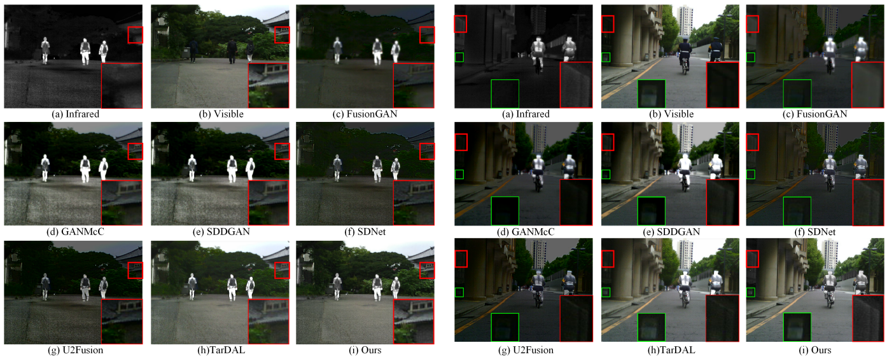

# Dif-Fusion
This is Pytorch implementation for “Dif-Fusion: Toward High Color Fidelity in Infrared and Visible Image Fusion with Diffusion Models” 

## Overview

The overall framework for Dif-Fusion
## Fusion examples


## Running the code

Run train_ddpm.py to train a diffusion model for infrared and visible images.

Run train_fusion_head.py to train the fusion model.

Run t_fusion.py to obtain the fused color images.

Please set paths to infrared and visible image folds in train_xxx.py its corresponding json files.
If there are trained models, set paths to these files in xxxx.json. 

- The trained weights can be downloaded from:  https://pan.baidu.com/s/1zOz9LRQsSnM1TDF7yYvXIw 
Password: q17w

- The datasets can be downloaded from: https://github.com/Linfeng-Tang/Image-Fusion

- For the codebase, please refer to: https://github.com/wgcban/ddpm-cd 

- For the evaluation, please refer to: https://github.com/Linfeng-Tang/Image-Fusion

## BibTeX
```
@ARTICLE{Diffusioncolor ,
  author={Yue, Jun and Fang, Leyuan and Xia, Shaobo and Deng, Yue and Ma, Jiayi},
  journal={IEEE Transactions on Image Processing}, 
  title={Dif-Fusion: Toward High Color Fidelity in Infrared and Visible Image Fusion With Diffusion Models}, 
  year={2023},
  volume={32},
  pages={5705-5720},
  doi={10.1109/TIP.2023.3322046}}
```
